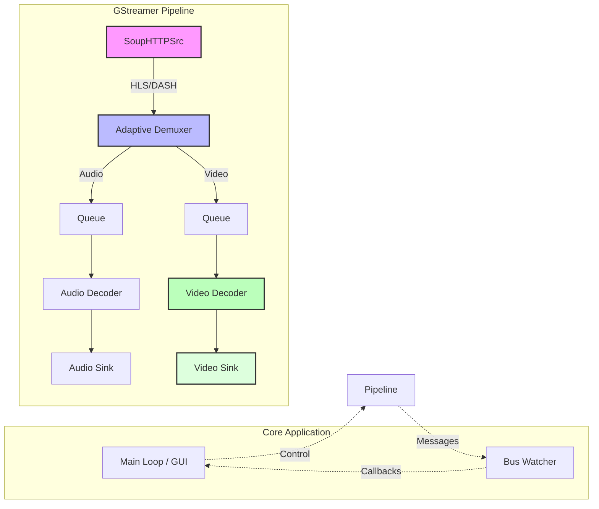

# Native C++ GStreamer Video Player

A high-performance, native C++ application for video playback using the GStreamer multimedia framework. This project demonstrates a production-grade approach to handling modern adaptive streaming protocols (HLS, DASH) within a custom C++ pipeline architecture.

## 🌟 Key Features

*   **Native C++ Implementation**: Built directly on top of `libgstreamer` and `glib` for maximum performance and control.
*   **Universal Playback**: Supports HTTP Live Streaming (HLS) and Dynamic Adaptive Streaming over HTTP (DASH) out of the box.
*   **Adaptive Bitrate (ABR)**: automatic quality switching based on network conditions (handled by GStreamer native plugins).
*   **Cross-Platform Architecture**: Designed to run on macOS (Cocoa event loop integration) and Linux.
*   **Robust State Management**: Handles asynchronous bus messages for errors, buffering, and state transitions (NULL -> READY -> PAUSED -> PLAYING).

## 🏗 Architecture Overview

The player leverages the `playbin` element, an auto-plugging pipeline that dynamically constructs the decoding graph based on the input stream type.

### High-Level Components
1.  **Application Logic (`main.cpp`)**:
    *   Initializes the GStreamer core.
    *   Configures the pipeline (`playbin`).
    *   Runs the main event loop (`GMainLoop` / `gst_macos_main`).
    *   Monitors the GStreamer Bus for messages.
2.  **Pipeline**:
    *   **Source**: `souphttpsrc` (for HTTP/HTTPS).
    *   **Demuxer**: `hlsdemux` / `dashdemux` (adaptivity logic).
    *   **Decoder**: Automatically selected hardware-accelerated decoders (e.g., `vtdec` on macOS, `vaapidec` on Linux).
    *   **Sink**: `autovideosink` (OpenGL/Metal/X11).

### 📐 Pipeline Architecture Diagram



For a deep dive into the design decisions, DRM strategy, and ABR logic, please refer to the [**Design Document**](design_doc.md).

## 🛠 Prerequisites

To build and run this project, you need a C++11 compliant compiler and the GStreamer development libraries.

### macOS (via Homebrew)
```bash
brew install gstreamer
brew install pkg-config
```

### Linux (Debian/Ubuntu)
```bash
sudo apt-get update
sudo apt-get install \
    build-essential \
    pkg-config \
    libgstreamer1.0-dev \
    libgstreamer-plugins-base1.0-dev \
    gstreamer1.0-plugins-good \
    gstreamer1.0-plugins-bad \
    gstreamer1.0-plugins-ugly
```

## 🚀 Build & Run

### 1. Compilation
We provide a standard `Makefile` that handles `pkg-config` paths automatically.

```bash
make
```
*This produces the `simple_player` executable.*

### 2. Basic Usage
Run the player without arguments to play the default HLS test stream (Big Buck Bunny):

```bash
./simple_player
```

### 3. Custom Stream
You can pass any valid URI (HLS, DASH, or MP4) as the first argument:

```bash
# Play a DASH stream
./simple_player https://dash.akamaized.net/akamai/bbb_30fps/bbb_30fps.mpd

# Play a local file
./simple_player file:///path/to/video.mp4
```

## 🧪 Testing

### Automated E2E Test
A smoke test script is included to verify the player's stability. It runs the player for 5 seconds and ensures it doesn't crash or exit prematurely.

```bash
./run_e2e.sh
```

### Manual Verification
On successful playback, you should see logs indicating state transitions:
```text
State changed from NULL to READY
State changed from READY to PAUSED
State changed from PAUSED to PLAYING
```

## ⚠️ Troubleshooting

**MacOS Window Not Showing:**
*   Ensure you are calling `gst_macos_main()` if you are writing your own main loop. GStreamer requires the Cocoa event loop to run on the main thread for correct video rendering. This project handles this in `main.cpp`.

**Missing Plugins:**
*   If you see "element not found" errors, you may be missing GStreamer plugin sets. Ensure `gst-plugins-good`, `gst-plugins-bad`, and `gst-plugins-ugly` are installed.

## 🤝 Contributing

1.  Fork the repository.
2.  Create your feature branch (`git checkout -b feature/amazing-feature`).
3.  Commit your changes (`git commit -m 'Add some amazing feature'`).
4.  Push to the branch (`git push origin feature/amazing-feature`).
5.  Open a Pull Request.

---
*Created by Matheus Uchoa.*
